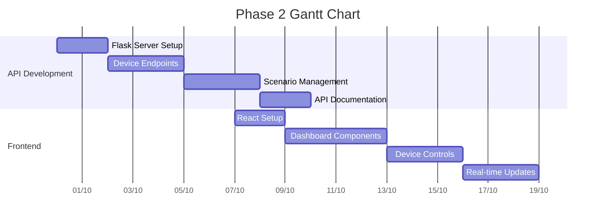
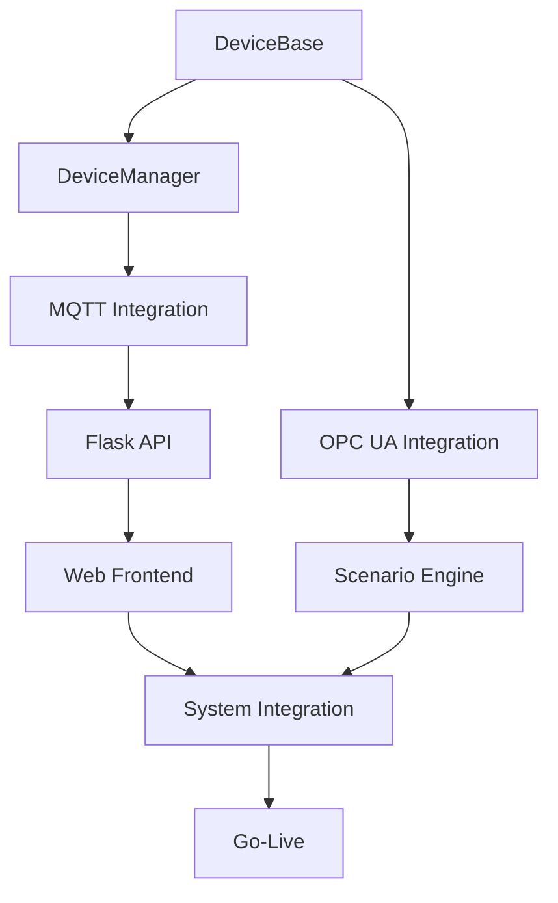

# Projektplan und Meilensteine
## IoT Device Emulator

**Datum:** 25. August 2025  
**Version:** 1.0  
**Projektleiter:** [Name]  
**Projektzeitraum:** 14 Wochen (02.09.2025 - 13.12.2025)  

---

## 1. Projektübersicht

### 1.1 Zeitplan-Übersicht
- **Projektstart:** 02.09.2025
- **Projektende:** 13.12.2025
- **Gesamtdauer:** 14 Wochen
- **Arbeitstage:** 70 Tage
- **Pufferzeit:** 10% (7 Tage)

### 1.2 Phasen-Übersicht
1. **Foundation Phase** (4 Wochen) - Core Engine
2. **Integration Phase** (4 Wochen) - Web Interface & API
3. **Enhancement Phase** (4 Wochen) - Advanced Features
4. **Launch Phase** (2 Wochen) - Deployment & Go-Live

## 2. Detaillierte Phasenpläne

### Phase 1: Foundation (Wochen 1-4)
**Zeitraum:** 02.09.2025 - 27.09.2025  
**Ziel:** Entwicklung der Core Engine mit grundlegenden Device-Management-Funktionen

#### Woche 1 (02.09 - 06.09)
**Sprint 1: Project Setup & Core Architecture**

| Tag | Aktivität | Verantwortlich | Deliverable |
|-----|-----------|----------------|-------------|
| Mo 02.09 | Projekt Kick-off Meeting | Alle | Kick-off Protokoll |
| Di 03.09 | Entwicklungsumgebung Setup | Dev Team | Dev Environment |
| Mi 04.09 | CMake Projekt-Struktur | Lead Dev | Build System |
| Do 05.09 | DeviceBase Interface Design | Lead Dev | Interface Spec |
| Fr 06.09 | Sprint Review & Planning | Alle | Sprint Report |

**Deliverables:**
- [x] Projekt-Repository initialisiert
- [x] Build-System konfiguriert (CMake)
- [ ] DeviceBase abstrakte Klasse
- [ ] Grundlegende Projektstruktur

#### Woche 2 (09.09 - 13.09)
**Sprint 2: Device Manager Implementation**

| Tag | Aktivität | Verantwortlich | Effort (h) |
|-----|-----------|----------------|------------|
| Mo 09.09 | DeviceManager Klasse | Senior Dev | 8 |
| Di 10.09 | DeviceRunner Implementation | Senior Dev | 8 |
| Mi 11.09 | Thread-Management | Senior Dev | 6 |
| Do 12.09 | Unit Tests für Core | Junior Dev | 6 |
| Fr 13.09 | Code Review & Integration | Alle | 4 |

**Deliverables:**
- [ ] DeviceManager implementiert
- [ ] DeviceRunner implementiert
- [ ] Thread-sicheres Device-Management
- [ ] Unit Tests (Coverage >80%)

#### Woche 3 (16.09 - 20.09)
**Sprint 3: MQTT Protocol Integration**

| Tag | Aktivität | Verantwortlich | Dependencies |
|-----|-----------|----------------|--------------|
| Mo 16.09 | Paho MQTT Integration | Senior Dev | External Libs |
| Di 17.09 | MQTT Client Wrapper | Senior Dev | Paho Setup |
| Mi 18.09 | TemperatureSensor Implementation | Junior Dev | DeviceBase |
| Do 19.09 | MQTT Publishing Tests | Junior Dev | MQTT Client |
| Fr 20.09 | Integration Tests | QA | All Components |

**Deliverables:**
- [ ] Paho MQTT integriert
- [ ] MqttClient Adapter
- [ ] TemperatureSensor Gerät
- [ ] MQTT-basierte Datenpublikation

#### Woche 4 (23.09 - 27.09)
**Sprint 4: Configuration & Foundation Completion**

| Aktivität | Start | Ende | Duration | Resource |
|-----------|-------|------|----------|----------|
| YAML Config Parser | 23.09 | 24.09 | 2d | Senior Dev |
| Device Factory Pattern | 24.09 | 25.09 | 2d | Senior Dev |
| Error Handling | 25.09 | 26.09 | 2d | Junior Dev |
| M1 Milestone Review | 27.09 | 27.09 | 1d | Alle |

**Meilenstein M1: Core Engine MVP**
- ✅ Kriterien:
  - DeviceManager verwaltet min. 3 Geräte
  - MQTT-Publishing funktionsfähig
  - YAML-Konfiguration unterstützt
  - 90% Unit Test Coverage
- 📊 Success Metrics:
  - Performance: <100ms Startup pro Gerät
  - Stability: 24h Dauerlauf ohne Crashes
  - Memory: <50MB für 10 Geräte

### Phase 2: Integration (Wochen 5-8)
**Zeitraum:** 30.09.2025 - 25.10.2025  
**Ziel:** Web-Interface und REST API Entwicklung

#### Woche 5-6: Python Flask API
**Sprint 5-6: REST API Development**



**Deliverables Woche 5-6:**
- [ ] Flask REST Server
- [ ] Device Management Endpoints
- [ ] WebSocket für Real-time Data
- [ ] OpenAPI Documentation

#### Woche 7-8: Web Frontend & CLI
**Sprint 7-8: User Interfaces**

**Web Frontend (React/HTML):**
- [ ] Device Dashboard
- [ ] Real-time Monitoring Charts
- [ ] Scenario Editor
- [ ] Configuration Management

**CLI Tool:**
- [ ] Command Parser
- [ ] Device Commands (start/stop/status)
- [ ] Scenario Execution
- [ ] Batch Processing

**Meilenstein M2: Web Interface Beta**
- ✅ Kriterien:
  - Web Dashboard funktional
  - REST API vollständig
  - CLI Basic Commands
  - Integration mit C++ Backend
- 📊 Success Metrics:
  - Response Time: <200ms
  - UI Responsiveness: 60fps
  - API Availability: 99.9%

### Phase 3: Enhancement (Wochen 9-12)
**Zeitraum:** 28.10.2025 - 22.11.2025  
**Ziel:** Advanced Features und Protocol Support

#### Woche 9-10: OPC UA Integration
**Sprint 9-10: OPC UA Protocol Support**

| Work Package | Effort | Start | End | Resource |
|--------------|--------|-------|-----|----------|
| Open62541 Integration | 16h | 28.10 | 31.10 | Senior Dev |
| OPC UA Server Setup | 12h | 01.11 | 04.11 | Senior Dev |
| PressureValve Device | 8h | 05.11 | 06.11 | Junior Dev |
| OPC UA Testing | 8h | 07.11 | 08.11 | QA |

#### Woche 11-12: Scenario Engine & Advanced Features
**Sprint 11-12: Scenario Management**

**Scenario Engine:**
- [ ] Scenario Definition Format
- [ ] Scenario Execution Engine
- [ ] Event-based Triggers
- [ ] State Machine Support

**Advanced Features:**
- [ ] Device Clustering
- [ ] Performance Monitoring
- [ ] Historical Data Storage
- [ ] Export/Import Functions

**Meilenstein M3: Production Ready**
- ✅ Kriterien:
  - OPC UA Support implementiert
  - Scenario Engine funktional
  - Performance Benchmarks erfüllt
  - Dokumentation vollständig
- 📊 Success Metrics:
  - Multi-Protocol Support: MQTT + OPC UA
  - Scalability: 50+ concurrent devices
  - Reliability: 99.5% uptime

### Phase 4: Launch (Wochen 13-14)
**Zeitraum:** 25.11.2025 - 13.12.2025  
**Ziel:** Deployment, Testing und Go-Live

#### Woche 13: System Testing & Documentation
**Sprint 13: Pre-Launch Preparation**

| Activity | Duration | Dependencies | Deliverable |
|----------|----------|--------------|-------------|
| Load Testing | 2d | Complete System | Performance Report |
| Security Testing | 2d | Complete System | Security Report |
| Documentation Finalization | 3d | All Features | User Manuals |
| Deployment Testing | 2d | Documentation | Deployment Guide |
| Training Material | 1d | Documentation | Training Videos |

#### Woche 14: Go-Live & Launch
**Sprint 14: Production Launch**

```
Woche 14 Timeline:
Mo 09.12: Production Deployment
Di 10.12: User Training Sessions
Mi 11.12: Soft Launch (Limited Users)
Do 12.12: Full Launch
Fr 13.12: Launch Review & Project Closure
```

**Meilenstein M4: Go-Live**
- ✅ Kriterien:
  - Production Deployment erfolgreich
  - User Training abgeschlossen
  - Support-Prozesse etabliert
  - Performance Monitoring aktiv
- 📊 Success Metrics:
  - Deployment Success: 100%
  - User Adoption: >80% in ersten 2 Wochen
  - Support Tickets: <5% error rate

## 3. Ressourcenplanung

### 3.1 Team-Allocation

| Role | Person | Allocation % | Phase 1 | Phase 2 | Phase 3 | Phase 4 |
|------|--------|--------------|---------|---------|---------|---------|
| Projektleiter | [Name] | 100% | ✅ | ✅ | ✅ | ✅ |
| Lead Developer | [Name] | 100% | ✅ | ✅ | ✅ | ✅ |
| Senior C++ Dev | [Name] | 100% | ✅ | 50% | ✅ | 50% |
| Junior C++ Dev | [Name] | 100% | 80% | 20% | 80% | 20% |
| Python Developer | [Name] | 100% | 20% | ✅ | 50% | 30% |
| QA Engineer | [Name] | 50% | 20% | 50% | ✅ | ✅ |
| DevOps Engineer | [Name] | 30% | 10% | 30% | 50% | ✅ |

### 3.2 Kapazitätsplanung

**Gesamtkapazität:**
- **Entwicklung:** 420 Personentage
- **Testing:** 60 Personentage
- **Management:** 70 Personentage
- **DevOps:** 35 Personentage

**Kritischer Pfad:**
1. DeviceBase Design → DeviceManager → MQTT Integration
2. Flask API → Web Frontend → Integration Testing
3. OPC UA Integration → Scenario Engine → Performance Testing
4. System Testing → Deployment → Go-Live

## 4. Abhängigkeiten und Risiken

### 4.1 Externe Abhängigkeiten

| Abhängigkeit | Verantwortlich | Deadline | Risk Level | Mitigation |
|--------------|----------------|----------|------------|------------|
| Paho MQTT Libraries | External | 16.09 | Medium | Alternative MQTT libs evaluiert |
| Open62541 Library | External | 28.10 | Medium | Backup OPC UA solution |
| Infrastructure Setup | IT Ops | 30.09 | Low | Early coordination |
| Security Approval | Compliance | 25.11 | Medium | Early security review |

### 4.2 Interne Abhängigkeiten



### 4.3 Risiko-Timeline

| Woche | Hauptrisiken | Wahrscheinlichkeit | Mitigation |
|-------|--------------|-------------------|------------|
| 1-2 | Team Onboarding Delays | Low | Pre-kick-off prep |
| 3-4 | MQTT Integration Issues | Medium | Early prototyping |
| 5-6 | Python-C++ Integration | Medium | Spike in Week 4 |
| 7-8 | UI/UX Complexity | Medium | User feedback early |
| 9-10 | OPC UA Complexity | High | Expert consultation |
| 11-12 | Performance Issues | Medium | Continuous benchmarking |
| 13-14 | Deployment Problems | Low | Staging environment |

## 5. Qualitäts-Gates

### 5.1 Definition of Done

**Sprint Level:**
- [ ] Code Review approved (2+ reviewers)
- [ ] Unit Tests >90% coverage
- [ ] Integration Tests passing
- [ ] Documentation updated
- [ ] Performance benchmarks met

**Milestone Level:**
- [ ] All sprint DoDs met
- [ ] End-to-end testing passed
- [ ] Stakeholder approval
- [ ] Risk assessment updated
- [ ] Next phase planning completed

### 5.2 Quality Metrics

| Metric | Target | Measurement | Frequency |
|--------|--------|-------------|-----------|
| Code Coverage | >90% | Automated Tools | Daily |
| Bug Density | <1 bug/KLOC | JIRA Reports | Weekly |
| Performance | <100ms response | Load Tests | Sprint |
| Memory Usage | <100MB/10 devices | Profiling | Sprint |
| Availability | >99% | Monitoring | Continuous |

## 6. Kommunikation und Reporting

### 6.1 Meeting-Rhythmus

**Daily:**
- 09:00 Daily Standup (15 min)
- Blocker Resolution (ad-hoc)

**Weekly:**
- Freitag 14:00 Sprint Review (1h)
- Freitag 15:00 Sprint Planning (1h)
- Stakeholder Update (Email)

**Monatlich:**
- Executive Review Meeting
- Architecture Review Board
- Risk Assessment Update

### 6.2 Reporting-Templates

**Weekly Status Report:**
```
Week [X] Status Report - [Date]

🎯 This Week Accomplishments:
- [Completed items]

📋 Next Week Planned:
- [Planned items]

⚠️ Risks/Issues:
- [Current risks and mitigation]

📊 Metrics:
- Sprint Velocity: [X] story points
- Code Coverage: [X]%
- Bug Count: [X] open

🚦 Overall Status: Green/Yellow/Red
```

## 7. Budget-Tracking

### 7.1 Budget-Breakdown nach Phasen

| Phase | Budget | Actual | Variance | Status |
|-------|--------|---------|----------|---------|
| Phase 1 | €41.250 | TBD | TBD | Planned |
| Phase 2 | €41.250 | TBD | TBD | Planned |
| Phase 3 | €41.250 | TBD | TBD | Planned |
| Phase 4 | €20.625 | TBD | TBD | Planned |
| **Total** | **€165.000** | **TBD** | **TBD** | **Planning** |

### 7.2 Cost-Control Measures

- Wöchentliche Zeiterfassung
- Monatliche Budget-Reviews
- Change Request Impact Assessment
- Vendor Cost Monitoring

---

**Nächste Review:** 30.08.2025  
**Genehmigungsstand:** Draft  
**Version Control:** v1.0 - Initial Plan  
